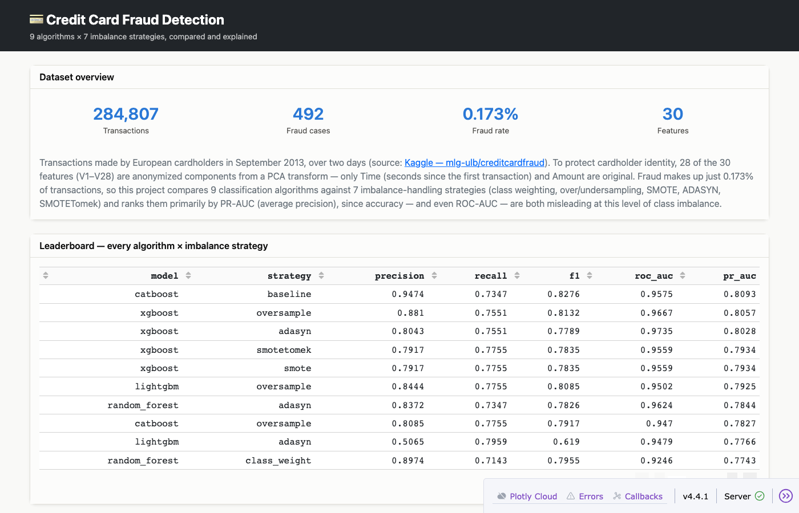
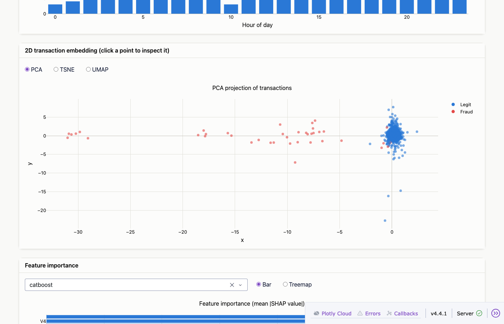
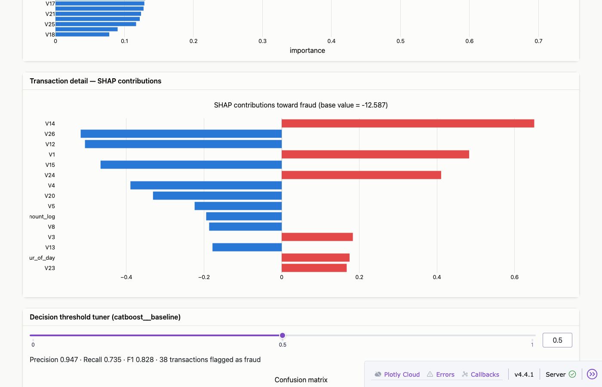
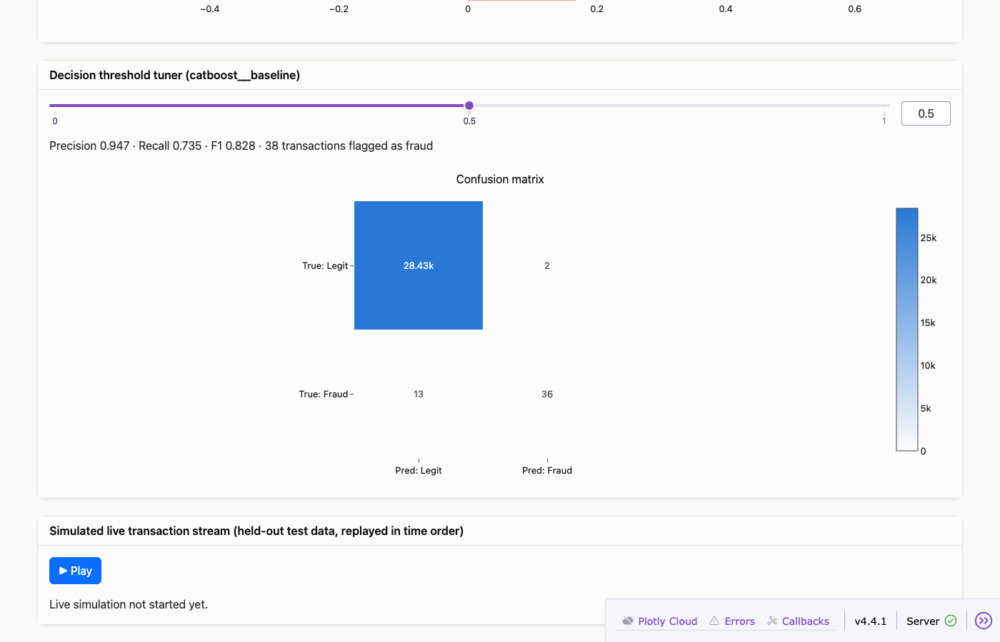

# Credit Card Fraud Detection

A from-scratch rebuild of a credit card fraud detection project: **9 classification
algorithms × 7 imbalance-handling strategies** (58 systematically compared runs),
SHAP explainability, PCA/t-SNE/UMAP embeddings, and an interactive Dash dashboard
styled after [dash.gallery/dash-nlp](https://dash.gallery/dash-nlp/).

For the reasoning behind every decision here — what the EDA found, why PR-AUC and
not accuracy, what each resampling technique actually does and how it performed —
see **[UNDERSTANDING.md](UNDERSTANDING.md)**. For the build plan and status, see
[PLAN.md](PLAN.md).

## Results at a glance

Best strategy per algorithm, ranked by PR-AUC (average precision — the right
metric when the positive class is 0.173% of the data; see
[UNDERSTANDING.md](UNDERSTANDING.md#1-the-problem-stated-precisely)):

| Model | Best strategy | Precision | Recall | F1 | ROC-AUC | PR-AUC |
|---|---|---|---|---|---|---|
| CatBoost | baseline | 0.947 | 0.735 | 0.828 | 0.958 | **0.809** |
| XGBoost | oversample | 0.881 | 0.755 | 0.813 | 0.967 | 0.806 |
| LightGBM | oversample | 0.844 | 0.776 | 0.809 | 0.950 | 0.793 |
| Random Forest | adasyn | 0.837 | 0.735 | 0.783 | 0.962 | 0.784 |
| KNN | baseline | 0.917 | 0.673 | 0.776 | 0.888 | 0.713 |
| Logistic Regression | baseline | 0.828 | 0.490 | 0.615 | 0.942 | 0.655 |
| SVM (linear) | baseline | 0.839 | 0.531 | 0.650 | 0.932 | 0.652 |
| Decision Tree | baseline | 0.735 | 0.735 | 0.735 | 0.867 | 0.540 |
| Naive Bayes | adasyn | 0.034 | 0.816 | 0.064 | 0.947 | 0.083 |

Full 58-run comparison lives in `results/model_comparison.csv` and is browsable/sortable
in the dashboard's leaderboard.

## Screenshots






## Project structure

```
data/
  raw/              # download creditcard.csv here (see data/raw/README.md)
  processed/        # generated by src/data.py: train/val/test splits
notebooks/
  01_eda.ipynb      # exploratory analysis behind UNDERSTANDING.md's findings
src/
  data.py           # load, feature-engineer, split
  resampling.py     # the 7 imbalance-handling strategies
  models.py         # the 9-algorithm registry
  train.py          # runs the full 9x7 grid, writes results/ and models/
  explain.py        # precomputes SHAP values per algorithm's best run
  embeddings.py     # precomputes PCA/t-SNE/UMAP projections
results/            # model_comparison.csv, shap_cache/, embedding_cache/ (generated)
models/             # trained model pipelines (generated)
dashboard/
  app.py            # entry point
  layout.py          # static card layout
  figures.py         # Plotly figure builders + color palette
  data_loaders.py    # shared IO helpers
  callbacks.py       # wires the cards to live interaction
```

## Setup & running it

First, get the dataset from Kaggle — see `data/raw/README.md` for the exact
steps (not redistributed here since Kaggle doesn't allow it). Then:

```bash
./run.sh
```

That's the whole thing. It creates the virtualenv, installs dependencies,
installs `libomp` via Homebrew if you're on macOS and don't have it, then runs
whichever pipeline steps haven't been run yet (data prep → training → SHAP →
embeddings), and finally starts the dashboard at **http://localhost:8050**.

It's safe to re-run any time: every step is skipped if its output already
exists, so after the first run (which trains all 58 model/strategy combinations
and can take several minutes) it just launches the dashboard in seconds. To
force a step to redo, delete its output first — e.g. `rm -rf results/ models/`
to retrain everything from scratch.

<details>
<summary>Prefer to run each step yourself? (what <code>run.sh</code> does, unrolled)</summary>

```bash
python3 -m venv .venv
source .venv/bin/activate
pip install -r requirements.txt

# macOS only, if you don't already have it — needed by XGBoost/LightGBM:
brew install libomp

python3 -m src.data          # -> data/processed/{train,val,test}.csv
python3 -m src.train         # -> results/model_comparison.csv, models/*.joblib
python3 -m src.explain       # -> results/shap_cache/*.joblib
python3 -m src.embeddings    # -> results/embedding_cache/*.joblib
python3 -m dashboard.app     # -> http://localhost:8050
```

</details>

## Dashboard guide

- **Dataset overview** — what the data is and why PR-AUC is the primary metric.
- **Leaderboard** — all 58 algorithm×strategy runs, sortable.
- **Compare two runs** — pick any two runs for a side-by-side metric comparison.
- **Fraud volume over time** — fraud count by hour of day.
- **2D transaction embedding** — toggle PCA/t-SNE/UMAP; **click a point** to load
  that exact transaction's SHAP explanation below.
- **Feature importance** — mean |SHAP value| per feature, bar or treemap, per
  selected algorithm.
- **Transaction detail** — SHAP waterfall for the selected transaction.
- **Decision threshold tuner** — drag the slider to see precision/recall/F1 and
  the confusion matrix update live for the best overall model.
- **Live transaction stream** — press Play to replay held-out test transactions
  in time order with real-time model inference and fraud flagging (deliberately
  oversamples fraud vs. its real ~0.17% rate — otherwise the demo would run a
  long time between hits).
